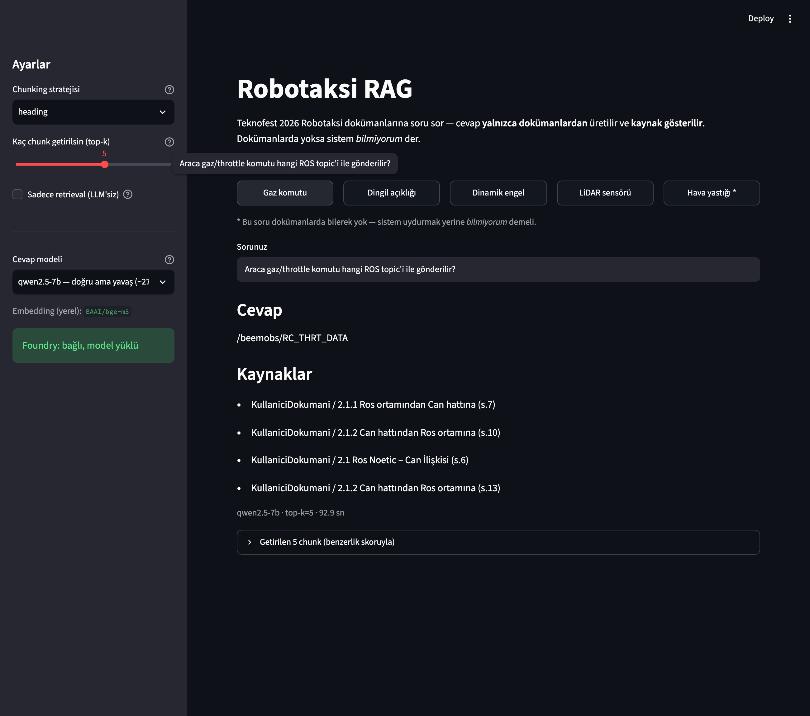
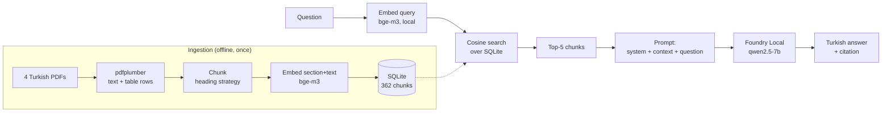
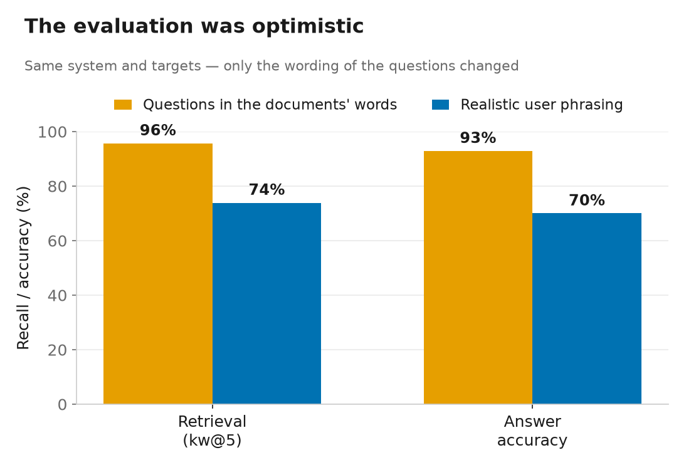

# Robotaksi RAG — A Local, Offline Document Q&A Assistant

A Retrieval-Augmented Generation (RAG) system that answers natural-language questions about the
official Teknofest 2026 Robotaxi competition documents and **cites its sources**, running entirely
on-device with no internet connection. The source documents are Turkish technical PDFs, so the
assistant retrieves over Turkish text and answers in Turkish.

**This is not just a working pipeline — it is a measured one.** Retrieval and answer quality are
evaluated separately against ground-truth question sets, and every design decision was adopted (or
rejected) because it moved a number. Ten experiments, including four honestly-reported negative
results, are written up in **[docs/EXPERIMENTS.md](docs/EXPERIMENTS.md)**.



## Architecture



| Layer | Technology | Notes |
|---|---|---|
| PDF extraction | `pdfplumber` | per-page; table cells serialised back into text |
| Chunking | `heading` (also `fixed`) | each chunk keeps a `(doc, page, section)` source label |
| Embedding | sentence-transformers `BAAI/bge-m3` | **no embedding model in the Foundry catalog** → run locally |
| Vector store | SQLite | small corpus → brute-force cosine is enough |
| Generation | Foundry Local `qwen2.5-7b` | OpenAI-compatible local API, fully offline |
| UI | Streamlit | question, answer, citations, retrieved-chunk inspector |

**Why embeddings don't come from Foundry Local:** this Foundry installation's catalog contains no
embedding models (every entry is a `chat` task). Since RAG cannot work without embeddings, they are
generated locally with sentence-transformers; Foundry is used only for answer generation. Both run
fully offline once the models are downloaded.

## Results at a glance



The headline lesson of the project: numbers measured on questions written in the documents' own
vocabulary are optimistic. On realistic user phrasing, the honest operating point is:

| | Document-vocabulary questions | **Realistic user phrasing** |
|---|---|---|
| Retrieval (kw@5) | 95.7% | **73.9%** |
| Answer accuracy | 92.9% | **70%** |
| Refusal on unanswerable questions | 100% | **100%** |

Selected findings (full detail and figures in **[docs/EXPERIMENTS.md](docs/EXPERIMENTS.md)**):

- **The benchmark can drive the wrong decision.** Hybrid BM25+vector retrieval looked like a clear
  win on easy questions and made the system *worse* on realistic ones — it was rejected only because
  it was measured on both. (Exp. 6)
- **Retrieval was not the bottleneck for answers — the generator was.** At 91% retrieval, the small
  1.5B model still answered only 40% correctly, misreading tables; the 7B model reached 100%. (Exp. 5)
- **Better retrieval can *increase* hallucination.** A stronger embedding model surfaced related-but-
  wrong content; refusal dropped to 75% until a prompt rule restored it to 100%. (Exp. 8)
- **What actually closed the realistic-phrasing gap:** five fixes were tried; only a stronger
  embedding model (bge-m3, +13 points) worked. Hybrid, deeper top-k, reranking and query expansion
  were all measured and rejected. (Exp. 7, 9, 10)

## Setup (macOS / Apple Silicon)

1. **Dependencies:**
   ```bash
   pip install -r requirements.txt
   ```
   On first run the embedding model (`BAAI/bge-m3`) downloads from Hugging Face (~4.3 GB); no
   internet is needed afterwards. For a smaller footprint at a measured accuracy cost, set
   `EMBED_MODEL` to `intfloat/multilingual-e5-small` (with the `query:` / `passage:` prefixes) and
   re-run `ingest.py` — see Experiment 7.

2. **Foundry Local** (chat only) must be running. It stops on reboot:
   ```bash
   foundry service status         # if 🔴 not running:
   foundry service start
   foundry model load qwen2.5-7b
   ```
   ⚠️ While the service is down, `foundry service list` can hang — check `service status` first.

3. **The port changes on every start.** Pass it without editing code:
   ```bash
   export FOUNDRY_PORT=62889      # the port shown by `service status`
   ```

4. **Model name:** Foundry's API rejects the short alias (HTTP 400); the full model ID is required.
   Set it as `CHAT_MODEL` in `config.py`:
   ```bash
   curl -s "http://127.0.0.1:$FOUNDRY_PORT/v1/models"   # e.g. qwen2.5-7b-instruct-generic-gpu:4
   ```

5. Place the four source PDFs in `data/`. They are official Teknofest documents and are **not**
   redistributed in this repo — see [`data/README.md`](data/README.md) for the exact filenames.

## Usage

**Web UI** (recommended) — exposes chunking strategy, `top-k` and chat model as live controls,
shows citations, and includes a retrieved-chunk inspector with similarity scores. A "retrieval
only" mode works even when Foundry is down (embeddings are local).

```bash
streamlit run app.py
```

**Command line:**

```bash
cd src
python ingest.py                              # PDF -> chunks -> embeddings -> SQLite
python answer.py "Kırmızı ışık ihlalinin ceza puanı nedir?"
```

**Evaluation** (all reproducible):

```bash
cd eval
python run_eval.py                            # retrieval Recall@k, fixed vs heading
python run_eval.py eval_set_paraphrase.json   # the same, on realistic phrasing (harder)
python run_answer_eval.py                     # answer accuracy + refusal rate
python compare_embeddings.py                  # embedding model comparison
python compare_retrieval_modes.py             # dense vs BM25 vs hybrid vs rerank
python compare_query_expansion.py <set> <model>
python ablation_contextual_header.py          # effect of embedding the section heading
```

## Corpus

| Document | Short name | Contents |
|---|---|---|
| Competition rules | `Sartname` | rules, penalty/scoring tables, lap scenarios |
| User manual | `KullaniciDokumani` | ROS/CAN topics, driving commands |
| General information | `GenelBilgilendirme` | BEE1 vehicle specifications |
| Architecture | `Mimari` | hardware/software architecture |

Every chunk carries a `(doc_name, page, section)` label — this gives source citation for free and
makes "did retrieval reach the right document?" a measurable property. Processed corpus:
**362 chunks**.

## Limitations (short)

Realistic-phrasing accuracy (~70%) is the main weakness; the ranking headroom is real (top-30
recall is 96%) but the only remaining lever — an in-domain fine-tuned reranker — is out of scope.
The answer-quality set is small and substring-scored. The 7B model is ~27 s/answer and memory is
tight on 16 GB. Full discussion in [docs/EXPERIMENTS.md](docs/EXPERIMENTS.md#known-limitations--honesty-notes).

## Project structure

```
app.py              Streamlit UI
src/
  config.py         all settings (models, prefixes, paths, TOP_K, RETRIEVAL_MODE)
  pdf_extract.py    PDF -> clean per-page text + serialised table rows
  chunker.py        fixed / heading chunking
  embed.py          embed_passages / embed_query (asymmetric-prefix support)
  db.py · ingest.py SQLite schema + ingestion orchestrator
  retrieve.py       question -> top-k (dense / lexical / hybrid / rerank modes)
  lexical.py · rerank.py · expand.py    components for the retrieval experiments
  answer.py         context + question -> Foundry chat -> answer + citations
eval/
  eval_set*.json · answer_set*.json     ground-truth question sets (+ paraphrased)
  run_eval.py · run_answer_eval.py       the two core metrics
  compare_*.py · ablation_*.py           the experiment harnesses
docs/
  EXPERIMENTS.md    full evaluation report
  make_figures.py · assets/              reproducible result figures
```

> Note: source-code comments are in Turkish (the author's working language); the documentation and
> public interface are English.
