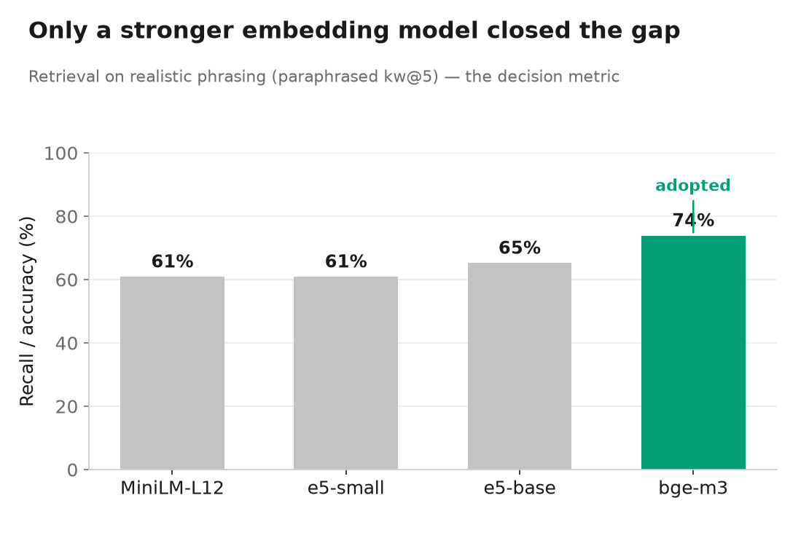

# Experiments & Evaluation

Detailed evaluation report for the Robotaksi RAG project. For setup and usage, see the
[main README](../README.md); this document is the full experimental record.

**What makes this project a *measured* system:** retrieval and generation are evaluated
**separately**. A wrong answer can come either from retrieving the wrong passage or from the
model misreading a correct one, and only separate metrics can tell those apart (Experiment 5
shows a case where retrieval was right and the answer was still wrong). Every design decision
below was adopted — or rejected — because it moved a number. All figures are reproducible with
the scripts named in each section.

### Headline finding


The single most important result: the impressive numbers (95%+) are largely an artefact of
questions written in the documents' own vocabulary. Measured on realistic user phrasing, the
honest operating point is ~74% retrieval and ~70% answer accuracy. How that was discovered, and
what did and did not close the gap, is the story below.

---

## Methodology

**Retrieval set** (`eval/eval_set.json`): 23 questions. Each entry specifies
- `gold_doc` — the document that contains the answer,
- `keywords` — distinctive substring(s) expected to appear in the relevant passage.

**Ground-truth validation.** The questions were derived from the corpus itself, and every
keyword was programmatically verified to appear *only* in its own `gold_doc` (the validation
phase inside `run_eval.py`). Ambiguous questions were rejected and replaced — for example,
sensor names such as Velodyne and XSENS turned out to appear in three documents at once, since
the architecture doc specifies the hardware, the user manual explains how to use it in ROS, and
the general-information doc lists it in the vehicle spec table. Without this validation step
the metrics would have been meaningless.

**Retrieval metrics:**

| Metric | What it measures | Interpretation |
|---|---|---|
| `doc_recall@k` | Is at least one chunk from the correct **document** in the top k? | coarse: correct routing |
| `kw_recall@k` | Does one of the top-k chunks contain the expected keyword? | fine: correct **passage** found |

**Answer-quality set** (`eval/answer_set.json`): 14 questions in two groups.
- 10 *answerable* questions, each with an expected distinctive value verified to exist in the
  corpus (e.g. the throttle topic `RC_THRT_DATA`, the axle-spacing limit `130`). Scored by
  substring match — crude but objective.
- 4 *unanswerable* questions whose subject was programmatically verified to be **absent** from
  the corpus (airbag count, 0–100 km/h time, trunk volume, plus one out-of-domain control).
  These test whether the model refuses instead of hallucinating.

**Realistic-phrasing sets** (`eval/eval_set_paraphrase.json`, `eval/answer_set_paraphrase.json`):
the same 23 + 14 targets restated the way a user would actually ask them, deliberately avoiding
the documents' own terms, with `gold_doc` / `keywords` / expected values unchanged. **The only
variable is phrasing.** After Experiment 6 these became the decision metric for every later change.

Question distribution (retrieval set): Sartname 8, KullaniciDokumani 6, Mimari 5,
GenelBilgilendirme 4.

---

## Experiment 1 — Retrieval baseline

`python run_eval.py` · e5-small + contextual header · 23 questions

| metric | fixed | heading |
|---|---|---|
| doc@3 | 100.0% | 100.0% |
| kw@3 | 87.0% | 87.0% |
| doc@5 | 100.0% | 100.0% |
| kw@5 | 91.3% | 91.3% |

Document routing is perfect; passage-level accuracy is 91.3%. The two remaining misses are the
"tunnel passage" task (mentioned only very briefly in the source) and the LiDAR technical
specifications (English datasheet terminology inside an otherwise Turkish corpus).

## Experiment 2 — Chunking strategy: `fixed` vs `heading`

On the original question set the two strategies are **identical on every metric**
(100 / 87.0 / 100 / 91.3), which initially suggested the choice did not matter. `heading` was
adopted anyway, only because it produces human-readable section labels for citations.

**That conclusion was wrong, and Experiment 6 corrected it.** On paraphrased questions the two
strategies diverge clearly:

| question set | metric | fixed | heading |
|---|---|---|---|
| original | kw@3 | 87.0% | 87.0% |
| paraphrased | doc@3 | 65.2% | **78.3%** |
| paraphrased | kw@3 | 30.4% | **47.8%** |

`heading` is substantially more robust to realistic phrasing — plausibly because the section
title adds topical context that a fixed-size window splits away. The "no difference" finding was
an artefact of an evaluation set that was too easy, not a property of the system.

## Experiment 3 — Ablation: embedding the section heading ("contextual header")

`python ablation_contextual_header.py` · model held constant (e5-small), only the embedding
input changes

| variant | doc@3 | kw@3 | doc@5 | kw@5 |
|---|---|---|---|---|
| A) `text` only | 100.0% | 73.9% | 100.0% | 73.9% |
| B) `section` + `text` | 100.0% | **87.0%** | 100.0% | **91.3%** |

**+17.4 points (kw@5) — the single largest retrieval improvement in the project.**

**Why:** the `heading` chunker sometimes captures the most distinctive information *in the
section heading itself*. For instance, the axle-spacing requirement is detected as a heading
("Dingil Açıklığı > 130") and therefore never appears in that chunk's `text` field. When the
embedding is built from `text` alone, this information never enters the vector and retrieval
can never find it. Prepending the heading to the embedding input closes this blind spot. The
stored `text` is unchanged — only the embedding input is enriched, so citations are unaffected.

## Experiment 4 — Embedding model comparison (first pass)

`python compare_embeddings.py` · identical chunks, each model with its own query/passage prefixes

| model | doc@3 | kw@3 | doc@5 | kw@5 |
|---|---|---|---|---|
| paraphrase-multilingual-MiniLM-L12-v2 | 100.0% | 87.0% | 100.0% | 87.0% |
| **intfloat/multilingual-e5-small** | 100.0% | 87.0% | 100.0% | **91.3%** |

e5-small was promoted to production on this evidence. **Experiment 7 later showed this margin was
an artefact of the easy set** — but e5 requires asymmetric prefixes (`query:` / `passage:`),
which is why `embed.py` exposes separate functions for query and passage embedding.

## Experiment 5 — Answer quality: chat model × retrieval depth

`python run_answer_eval.py <model-id>` · 10 answerable + 4 unanswerable questions

| chat model | top-k | accuracy | refusal | latency/answer |
|---|---|---|---|---|
| qwen2.5-1.5b | 3 | 40% (4/10) | 100% (4/4) | ~6.6 s |
| qwen2.5-1.5b | 5 | 90% (9/10) | **75% (3/4)** ⚠️ | ~6.6 s |
| qwen2.5-7b | 3 | 80% (8/10) | 100% (4/4) | ~27.5 s |
| **qwen2.5-7b** | **5** | **100% (10/10)** | **100% (4/4)** | ~27.5 s |

*(Latency: M1 MacBook, 16 GB, 3 runs after warm-up, idle machine. A busy machine roughly doubles
it — an observed run under concurrent load took 55 s.)*

This experiment produced the most interesting result in the project, in three parts:

1. **Retrieval was never the bottleneck for answer quality — the generator was.** With retrieval
   at 91.3% kw_recall, the 1.5B model still answered only 40% of factual questions correctly.
   Its errors were systematic table misreadings: it reported the axle spacing as "100 cm"
   (correct: >130), inverted the steering data ranges, and read the wrong row of a scoring table.

2. **Retrieval depth is a cheaper lever than model size.** Raising `top_k` from 3 to 5 lifted the
   small model from 40% to 90% accuracy — a larger gain than switching to a 4× bigger model at
   `top_k=3` (80%).

3. **But extra context is not free for a weak model.** At `top_k=5` the 1.5B model's refusal rate
   *dropped* from 100% to 75%: given more context it began answering an unanswerable question
   ("trunk volume") by improvising from unrelated vehicle dimensions. The 7B model used the extra
   context without being distracted. Accuracy and safety therefore have to be measured together —
   optimising one silently damaged the other.

**Adopted:** `qwen2.5-7b` with `top_k=5`.

> ⚠️ The 100% here does not survive realistic phrasing. Re-measured on paraphrased questions
> (Experiment 8), the same configuration scores 70%. Treat 100% as an upper bound.

Raising `top_k` further did **not help end to end**. Retrieval recall keeps improving with depth
(paraphrased kw@5 = 61%, kw@10 = 74%, kw@15 = 78%), but at `top_k=10` answer accuracy stayed at
60% — the extra context fixed two retrieval misses while introducing two new distraction errors,
including inverting a left/right steering range the model had answered correctly at `top_k=5`.
Better recall does not automatically become better answers — consistent with the "lost in the
middle" phenomenon (Liu et al., 2023): models attend least reliably to information buried in the
middle of a long context.

## Experiment 6 — Robustness to real user phrasing, and a rejected hypothesis

`python compare_retrieval_modes.py` · `python run_eval.py eval_set_paraphrase.json`

**Part A — how optimistic was the evaluation?** `eval_set_paraphrase.json` restates all 23
questions the way a user would ask them, avoiding the documents' terms; targets unchanged.

| metric | original questions | paraphrased questions |
|---|---|---|
| doc@3 | 100.0% | 78.3% |
| kw@3 | 87.0% | 47.8% |
| doc@5 | 100.0% | 78.3% |
| kw@5 | 91.3% | **60.9%** |

Passage accuracy falls from 91.3% to 60.9% — a 30-point drop. The headline number was measuring
the benchmark as much as the system. Failures cluster on generic questions ("which computer is
used in the vehicle?"), which drift toward the largest document instead of the specific one.

**Part B — hybrid retrieval: hypothesised, measured, rejected.** The obvious fix is to combine
dense embeddings with BM25 keyword matching (`src/lexical.py`) via Reciprocal Rank Fusion. A
single hand-picked example supported it — for *"how do I give the vehicle gas?"* BM25 ranked the
correct `RC_THRT_DATA` chunk first while dense missed it. Measured across all 23, it failed:

| kw@5 | original | paraphrased |
|---|---|---|
| dense | 91.3% | **60.9%** |
| lexical (BM25) | 95.7% | 39.1% |
| hybrid (RRF) | 95.7% | 47.8% |

A weight sweep confirmed no fusion setting rescues it (60.9 → 56.5 → 52.2 → 47.8% for
w = 0, 0.15, 0.3, 0.5). Paraphrased questions avoid the documents' vocabulary, which is exactly
what BM25 needs; with nothing to match it contributes noise, and rank fusion mixes that noise
into otherwise good dense rankings. **Not adopted** — code kept, `RETRIEVAL_MODE` carries a warning.

**The methodological point.** Judged only on the original set, hybrid looks like a clear
improvement (95.7% vs 91.3%) and would have been adopted — making the deployed system measurably
worse. An optimistic benchmark does not merely overstate quality; it actively drives wrong
decisions. Both this and the chunking conclusion (Experiment 2) were reversed by the harder set.

## Experiment 7 — Embedding models, re-judged on realistic phrasing

`python compare_embeddings.py` · four models, both question sets · decision metric = **paraphrased kw@5**



| model | original kw@5 | **paraphrased kw@5** | paraphrased doc@5 |
|---|---|---|---|
| paraphrase-multilingual-MiniLM-L12-v2 | 87.0% | 60.9% | 87.0% |
| intfloat/multilingual-e5-small | 91.3% | 60.9% | 78.3% |
| intfloat/multilingual-e5-base | 95.7% | 65.2% | 87.0% |
| **BAAI/bge-m3** | **100.0%** | **73.9%** | **95.7%** |

**bge-m3 was adopted: +13 points on the decision metric** (60.9% → 73.9%, three more questions of
23) and near-perfect document routing. The cost is size: 1024 dimensions, ~4.3 GB, slower encoding.

Two secondary observations, both consequences of judging on the harder set:

- **e5-base is not worth it.** Its +4.3 points is a single question — noise at n = 23. On the
  original set it looked like a clear winner (95.7% vs 91.3%); that gap did not survive.
- **Experiment 4's conclusion was overstated.** On paraphrased questions e5-small and MiniLM tie
  exactly (60.9%), and MiniLM is *better* at k = 3. Adopting e5-small over MiniLM was justified by
  the easy set alone. It cost nothing, but it was not the evidence we thought.

## Experiment 8 — End-to-end on realistic phrasing, and a hallucination it caused

`ANSWER_SET=answer_set_paraphrase.json python run_answer_eval.py`

| configuration | accuracy | refusal | total |
|---|---|---|---|
| e5-small + original prompt | 60% | 100% | 71.4% |
| bge-m3 + original prompt | **70%** | **75%** ⚠️ | 71.4% |
| **bge-m3 + strengthened prompt** | **70%** | **100%** | **78.6%** |

**Better retrieval produced the project's only hallucination.** Asked for the vehicle's trunk
volume — verified absent from the corpus — the bge-m3 system answered *"1.200 L olarak
belirtilmiştir"* ("stated as 1,200 L"). Stronger retrieval surfaces more content that is
topically related but does not answer the question, and the model treated a nearby plausible
number as the answer. **Improving retrieval can *increase* hallucination risk.**

The fix was not retrieval but instruction. One rule was added to the system prompt: *use a value
only if the context states it as the answer to the question asked; do not use values that are
merely related.* Refusal returned to 4/4 with no loss of accuracy; the honest end-to-end score
rose from 71.4% to 78.6%. On the original answer set the same change costs one question
(100% → 92.9%); since the decision rule is to judge on the realistic set, the trade was accepted.

**Honest note on scoring.** One of the three remaining errors is a flaw in the evaluation, not the
system. Asked which computer the vehicle uses, the model answers "Advantech 770H and MIC-75G20" —
exactly what the general-information document says; the expected value `MIC-770` was taken from the
architecture document. Two documents give different answers and the model picked one.

## Experiment 9 — Cross-encoder reranking: a headroom that stayed out of reach

`python compare_retrieval_modes.py dense rerank`

The depth sweep pointed at a ranking problem: with bge-m3 the correct passage is in the top 30
for **96%** of paraphrased questions, but reaches the top 5 for only 74%. A cross-encoder reranker
(`BAAI/bge-reranker-v2-m3`) reads the question and each candidate *together* and re-scores the top 30.

| kw@5 | original | paraphrased |
|---|---|---|
| dense | 100.0% | **73.9%** |
| pure rerank | 100.0% | 69.6% |
| RRF(dense, rerank) | 100.0% | 73.9% |

**Reranking did not help and was rejected.** Pure reranking was worse; blending only recovered to
dense's level. On *"how much must the car cross the line to be penalised?"* dense placed the correct
passage 3rd while the reranker confidently scored an unrelated passage 0.42 and buried the correct
one at rank 10 (verified with both text-only and section+text inputs).

The honest reading is not "reranking doesn't work" but "**this off-the-shelf reranker could not beat
an already-strong bge-m3 on this Turkish corpus.**" The 74% → 96% headroom is real; capturing it
would need a reranker fine-tuned on in-domain Turkish pairs, beyond this project's scope.

## Experiment 10 — LLM query expansion: hypothesised, measured, rejected

`python compare_query_expansion.py eval_set_paraphrase.json <model-id>`

The measured root cause of the gap is vocabulary mismatch (Experiment 6), so the last untried
lever was query expansion: ask the local LLM for a short list of technical terms and append them
to the query. Few-shot examples deliberately avoid all evaluation vocabulary; generation is at
temperature 0.

| expander | paraphrased kw@5 |
|---|---|
| none (baseline, bge-m3 dense) | **73.9%** |
| qwen2.5-1.5b | 69.6% |
| qwen2.5-7b, English-leaning prompt (v1) | 69.6% |
| qwen2.5-7b, Turkish-leaning prompt (v2) | 60.9% |

**Every configuration made retrieval worse.** Three failure modes: the 1.5b **cannot follow the
instruction** (it answered the question and fabricated "500 mm"); 7b v1 produced **wrong-language**
terms (generic English "axle_track" for a Turkish corpus); 7b v2, steered toward Turkish, **guessed
wrong** ("enlem"/latitude for wheelbase). One prompt iteration was allowed as an
implementation-fairness check; it made things worse, and iteration stopped there to avoid
overfitting prompts to the evaluation set.

The root cause matches Experiment 9: **generic components cannot zero-shot guess this corpus's
idiosyncratic vocabulary.** Final tally for the realistic-phrasing gap: **five attempted fixes,
one success (bge-m3), four measured rejections** (hybrid, top-k, reranker, query expansion).

## Data fix — table-aware PDF extraction

Not an experiment but a measured repair. `extract_text()` drops the cell values of some tables:
the red-light scoring table's points (60 / 20 / −30) were absent from the extracted text, making
the project's very first smoke-test question — *"what is the penalty for running a red light?"* —
unanswerable by any model. `extract_tables()` recovers those cells, so `pdf_extract.py` now
serialises table rows into the page text (prefixed lowercase so the heading detector cannot mistake
them for section titles). Corpus grew from 339 to 362 chunks.

Result: the first question ever asked of the system now answers correctly — **"-30"**, cited to
Sartname p.27. The decision metric was unchanged (paraphrased kw@5 stays 73.9%); the easy set paid
one question (kw@5 100% → 95.7%) as the general-information document grew from 9 to 14 chunks.

## Safety behaviour: refusing to answer

The system prompt instructs the model not to invent an answer when the context does not contain
one. In the production configuration it refuses **4/4** unanswerable questions, including
plausible-sounding vehicle questions verified absent from the corpus:

> **Q:** İstanbul'un nüfusu kaç milyondur? *(What is the population of Istanbul?)*
> **A:** Bu bilgi verilen dokümanlarda bulunmuyor. *(This information is not in the provided documents.)*

This behaviour is not free and not permanent: Experiment 8 shows it broke (3/4) the moment
retrieval got stronger, and had to be repaired with an explicit prompt rule. It is measured on
every change rather than assumed. Citations are never left to the LLM — they are generated
programmatically from the chunk labels, so the model cannot fabricate a source.

---

## Known limitations & honesty notes

1. **Realistic-phrasing performance is the main weakness, only partly fixed.** Honest operating
   numbers: **73.9% retrieval (kw@5)**, **70% answer accuracy**. Every in-scope lever was tried;
   only a stronger embedding model helped. The ranking headroom is real (top-30 recall is 96%),
   so the remaining lever is out of scope: a reranker/embedder **fine-tuned on in-domain Turkish**.
   Any future change must be judged on the paraphrased sets.
2. **Table extraction is repaired but not fully solved.** Some tables carry empty value cells even
   in `extract_tables()` (the p.32 technical-controls table), so a little layout-dependent loss remains.
3. **The answer-quality sets are small (10 + 4) and scored by substring match**, not semantic
   judgement — strict in both directions. Read 70% as an indicator, not a precise figure.
4. **Do not over-read the 100% doc_recall** — small four-document corpus, distinctive questions.
5. **Latency & memory.** 7B: ~27 s/answer on an idle M1/16 GB, ~2× busy. Both chat models + Streamlit
   + the embedding model sit near the 16 GB limit; a heavy extra process triggered an OOM kill.
   Unload one model (`foundry model unload qwen2.5-1.5b`) under memory pressure.
6. **Scale.** Brute-force cosine is fine for 362 chunks; a larger corpus needs a vector index
   (e.g. FAISS) or a SQLite vector extension.

## Regenerating the figures

The PNGs are committed, so you only need this to change them:

```bash
pip install matplotlib
python docs/make_figures.py    # -> docs/assets/*.png
```

The numbers are hard-coded from the experiments above (with source comments); update them there
if you re-measure.
